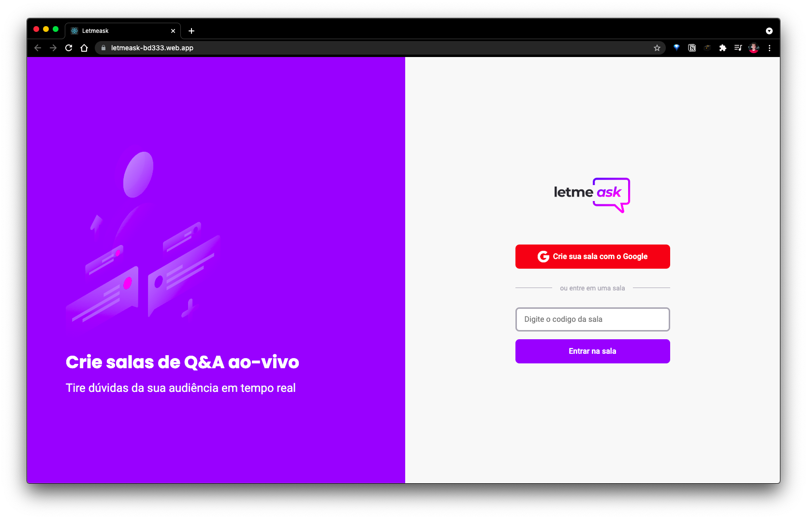

<p align="center">
  
</p>

<p align="center">
  
</p>

------
## 🧪 Technologies and main concepts developeds:

- [React](https://reactjs.org)
  - Page routing
  - ContextAPI

- [Firebase](https://firebase.google.com/)
  - Google's user authentication
  - Database ref
    - Listiners
    - Insert, update and delete data
    - Database hierarchy permissions rules

- [TypeScript](https://www.typescriptlang.org/)
  - Basic notations
  - Typing objects retrieved from Firebase realtime database

[Notion note](https://www.notion.so/NLW-6-b2a5c2214ee94d8d85772205a1f24404) taken during the event with those main concepts more abstracted to ease usage.

---
## 🚀 How to run the project

Cloning this repo.

```bash
$ git clone https://github.com/viniciuSquare/NLW-06_Letmeask
$ cd NLW-06_Letmeask
```

```bash
# install dependencies
$ npm i

# run it
$ npm start
```
It will be avaiable at http://localhost:3000.

[Firebase](https://firebase.google.com/) setup needed for you to run it. Brief instructions at [Notion note](https://www.notion.so/NLW-6-b2a5c2214ee94d8d85772205a1f24404)

## 💻 Projeto

Letmeask is Q&A app meant to ease content creator's communication to its audience.

Project done during the **[Next Level Week Together](https://nextlevelweek.com/)** event taught by [Diego Fernandes](https://github.com/diego3g).


 🔖 [***Layout***](https://www.figma.com/file/u0BQK8rCf2KgzcukdRRCWh/Letmeask/duplicate) 

Create account at[Figma](http://figma.com/).
